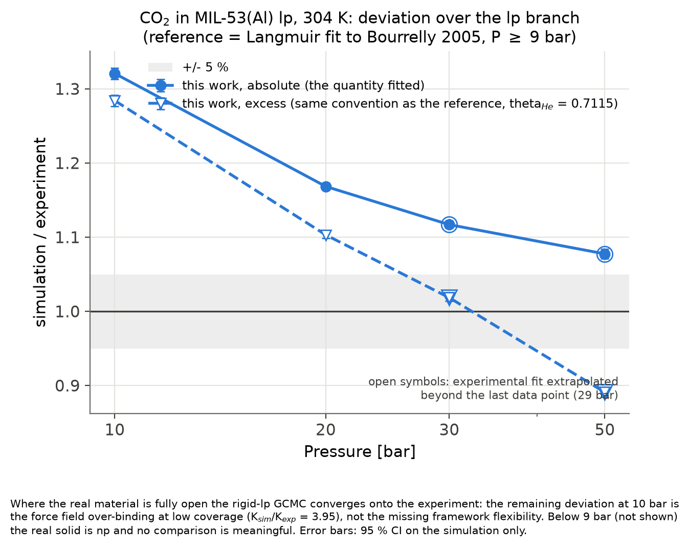

# GCMC of CO₂ in rigid large-pore MIL-53(Al)

Validation of a grand canonical Monte Carlo workflow (RASPA2) against experiment, for CO₂
adsorption in the large-pore (lp) form of MIL-53(Al) at 304 K. A complete GCMC workflow was built from scratch and validated in three stages: reproducing
RASPA's own reference calculations (CH₄ in MFI, CO₂ in Cu-BTC); computing the helium void
fraction and the zero-coverage Henry coefficient; and comparing a twelve-point isotherm
(0.01–50 bar) in the rigid lp framework with the manometric data of Bourrelly
et al. (2005) and the osmotic-ensemble analysis of Coudert et al. (2008). The rigid framework
**reproduces the saturation capacity of the open form to 0.5 %** (10.20 vs 10.14 molecules per
unit cell), but its **Langmuir constant is 3.95 times too high**: the generic UFF/DDEC/TraPPE
force field over-binds CO₂ at low coverage. The deviation falls from 32 % at 10 bar to 12 % at
30 bar (absolute loading), and to 2 % on the excess convention. By construction a rigid model
cannot produce the narrow-pore/large-pore step, so the computed isotherm is the "virtual
rigid-lp" branch in Coudert's sense.



Full technical note: [`docs/technical_note.md`](docs/technical_note.md).
**Every choice, number, failure and correction is recorded in [`NOTES.md`](NOTES.md)**, written
as the work happened — including what was tried and rejected.

## Cross-code check: LAMMPS `fix gcmc`

Same structure, force field and temperature, at three pressures. **Single-point energies on
one identical configuration agree to 0.002 %** (total interaction energy −18152.06 vs
−18152.36 K), so the force field is code-independent. The loadings are **consistent, not
confirmed**: RASPA lies inside the two-sided LAMMPS bracket everywhere, but LAMMPS cannot
reach RASPA's precision at reasonable cost, because `full_energy` forces a complete Ewald
evaluation for every trial move and its particle number is nearly frozen within a run
(sd(N) = 0.23–0.49 × RASPA's).

| p [bar] | LAMMPS from below | from above | RASPA |
|---|---|---|---|
| 10 | 9.08 | 9.29 | 9.127 ± 0.053 |
| 20 | 9.52 | 10.08 | 9.604 ± 0.038 |
| 30 | 9.42 | 9.91 | 9.800 ± 0.042 |

Molecules per unit cell. Details, protocol and diagnostics:
[`docs/technical_note.md`](docs/technical_note.md) (section 6).

## Reproduce
macOS with Homebrew; on Linux replace only the micromamba install line.

```bash
# 1. environment (RASPA2 2.0.50, native Apple-silicon build)
brew install micromamba
micromamba env create -f environment.yml     # creates the env "gcmc-mil53"
micromamba activate gcmc-mil53
simulate -v      # binary is `simulate`; NB it misreports "2.0.41" -- the version
                 # that ran is in the output header (Output/System_0/*.data)
```

```bash
# 2. sanity checks against RASPA's own reference outputs (~15 min + ~2.5 h)
git clone --depth 1 --branch v2.0.50 https://github.com/iRASPA/RASPA2 ~/src/RASPA2-2.0.50
bash scripts/run_example.sh mfi_ch4 && python scripts/compare_example.py mfi_ch4
bash scripts/run_example.sh cubtc_co2 && python scripts/compare_example.py cubtc_co2
```

```bash
# 3. structure (download once, verify by cell, transform to the 76-atom cell)
python scripts/fetch_structure.py            # Zenodo 3986573, md5 checked
python scripts/check_cif.py structures/MIL-53_Al_lp.cif

# 4. void fraction and zero-coverage Henry coefficient (~45 min + ~20 min)
bash scripts/run_helium.sh
bash scripts/run_widom.sh
```

```bash
# 5. isotherm: 12 points, 304 K, resumable (~12 h on 4 cores)
python scripts/make_inputs.py --cif structures/MIL-53_Al_lp.cif --helium-vf 0.7115
python scripts/make_inputs.py --cif structures/MIL-53_Al_lp.cif --helium-vf 0.7115 \
       --init 20000 --cycles 200000 --pressures 1e3 2e3 5e3
bash scripts/run_isotherm.sh production 4
```

```bash
# 6. analysis and figures
python scripts/isotherm.py       # CSV + main figure (both conventions, second axis)
python scripts/langmuir.py --column absolute   # fits; refuses non-monotonic data, with a reason
python scripts/convergence.py --points 1000 10000 5000000
python scripts/deviation.py      # the figure above
```

## Layout
`environment.yml` · `forcefield/` · `structures/` (working CIF + original with md5) ·
`templates/` · `scripts/` · `reference/` (digitised data + column/convention README) ·
`results/` (CSV and figures) · `docs/` · `NOTES.md`. Run directories are not tracked
(`runs/` is gitignored); the scripts regenerate them.

## License and citation
MIT, see [`LICENSE`](LICENSE). Citation metadata in [`CITATION.cff`](CITATION.cff).
