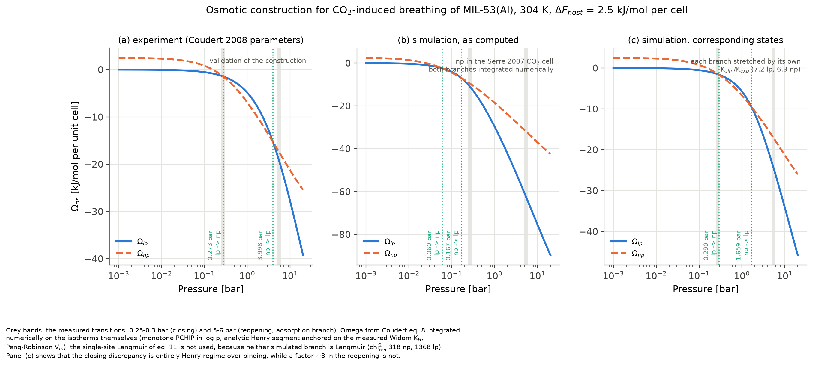

# CO₂ breathing in MIL-53(Al) from rigid GCMC

## What I did

- CO₂ isotherms at 304 K with RASPA2, in the rigid large-pore (lp) form and in two narrow-pore (np) structures.
- Checked the setup against RASPA reference cases, against experiment (Bourrelly et al. 2005) and against LAMMPS.
- Used the osmotic construction of Coudert et al. (2008) to predict the lp→np and np→lp transitions from the two rigid isotherms.

## Main results

1. **The np structure matters more than the force field.** In the hydrated np structure CO₂ hardly fits, and the Henry constant is about 300 times below experiment. In the np cell measured with CO₂ inside (Serre et al. 2007), it is about 6 times above — the same over-binding the force field gives for lp.
2. **With the right np structure, the two rigid isotherms give the double transition**: the framework closes, then reopens.
3. **The pressures are too low**, because the generic force field over-binds CO₂ at low loading. After correcting for it, the closing comes out at 0.29 bar (experiment: 0.27 bar), and the free-energy difference between the empty phases at about 2.4 kJ/mol (Coudert: 2.5). The reopening stays about three times too low; possible reasons are in NOTES.md.

## Repository

- `scripts/` — setup, runs and analysis
- `results/` — tables and figures
- `NOTES.md` — every decision, including the mistakes I found and corrected
- `docs/technical_note.md` — full technical description and how to reproduce everything

## References

- Bourrelly et al., J. Am. Chem. Soc. 2005, 127, 13519
- Serre et al., Adv. Mater. 2007, 19, 2246
- Coudert et al., J. Am. Chem. Soc. 2008, 130, 14294 (arXiv:1904.09588)
- Salles et al., Angew. Chem. Int. Ed. 2008, 47, 8487
- Loiseau et al., Chem. Eur. J. 2004, 10, 1373
