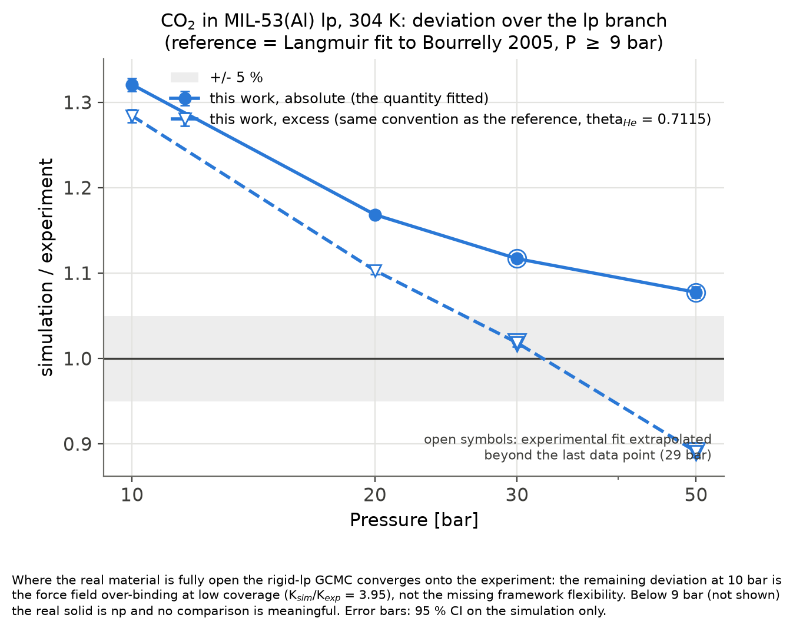

# GCMC of CO₂ in MIL-53(Al): the rigid lp branch, and breathing

Validation of a grand canonical Monte Carlo workflow (RASPA2) against experiment, for CO₂
adsorption in MIL-53(Al) at 304 K — first the rigid large-pore branch, then the
narrow-pore phase and the osmotic construction for the breathing transition. **The headline
finding of the second part is that structure, not force field, dominates the error**: the
same force field goes from 326× below experiment to 6.3× above it when the narrow-pore cell
is replaced by the one CO₂ actually induces. A complete GCMC workflow was built from scratch and validated in three stages: reproducing
RASPA's own reference calculations (CH₄ in MFI, CO₂ in Cu-BTC); computing the helium void
fraction and the zero-coverage Henry coefficient; and comparing a twelve-point isotherm
(0.01–50 bar) in the rigid lp framework with the manometric data of Bourrelly
et al. (2005) and the osmotic-ensemble analysis of Coudert et al. (2008). The rigid framework
**reproduces the saturation capacity of the open form to 0.5 %** (10.20 vs 10.14 molecules per
unit cell), but its **Langmuir constant is 3.95 times too high**: the generic UFF/DDEC/TraPPE
force field over-binds CO₂ at low coverage. The deviation falls from 32 % at 10 bar to 12 % at
30 bar (absolute loading), and to 2 % on the excess convention. A rigid model cannot produce the
np/lp step *within a single isotherm*, so this one is the "virtual rigid-lp" branch in
Coudert's sense — but a pair of rigid branches, one per phase, does predict the transition
through the osmotic ensemble, which is the second half of this work.



Full technical note: [`docs/technical_note.md`](docs/technical_note.md).
**Every choice, number, failure and correction is recorded in [`NOTES.md`](NOTES.md)**, written
as the work happened — including what was tried and rejected.

## Cross-code check: LAMMPS `fix gcmc`

Same structure, force field and temperature, at three pressures. **Single-point energies on
one identical configuration agree to 0.002 %** (total interaction energy −18152.06 vs
−18152.36 K), so the force field is code-independent. The loadings are **consistent, not
confirmed**: RASPA lies inside the two-sided LAMMPS bracket everywhere, but LAMMPS cannot
reach RASPA's precision at reasonable cost, because `full_energy` forces a complete Ewald
evaluation for every trial move and its particle number is nearly frozen within a run
(sd(N) = 0.23–0.49 × RASPA's).

| p [bar] | LAMMPS from below | from above | RASPA |
|---|---|---|---|
| 10 | 9.08 | 9.29 | 9.127 ± 0.053 |
| 20 | 9.52 | 10.08 | 9.604 ± 0.038 |
| 30 | 9.42 | 9.91 | 9.800 ± 0.042 |

Molecules per unit cell. Details, protocol and diagnostics:
[`docs/technical_note.md`](docs/technical_note.md) (section 6).

## Breathing: the narrow-pore branch and the osmotic construction

The same workflow was then pushed at the thing a rigid model supposedly cannot do — the
np↔lp breathing transition.

**The rigid np cell adsorbs essentially nothing**: Henry constant 2.86 × 10⁻⁷ mol kg⁻¹ Pa⁻¹,
**326× below experiment**, against a force field that gets the lp saturation capacity right
to 0.5 %. Three independent measurements show this is the *structure*, not the force field.
The Widom excess chemical potential is −0.14 kJ mol⁻¹ — zero — while the binding energy,
−25.96 kJ mol⁻¹, is *deeper* than lp's: CO₂ binds strongly where it fits, and almost nowhere
fits. Favourable insertion sites are 224× rarer than in lp. Zeo++ finds **no percolating
accessible volume at any probe size down to helium's**.

The reason is that the file is the *dehydrated* np geometry. The np form CO₂ actually induces
is wider, and Serre et al. (2007) measured it for MIL-53(Cr) under 1 bar CO₂ — the opening is
almost entirely along one axis, 7.849 → 8.310 Å, a shear of the lozenge rather than a
dilation. Transplanting our Al framework into that cell by a volume-preserving basis change
and relaxing internal coordinates at fixed cell (MACE-MP-0 + D3, validated first on both
empty cells to +0.13 % and +2.14 %) gives a branch whose Henry constant is
**5.63 × 10⁻⁴ mol kg⁻¹ Pa⁻¹ — 1965× larger, from the structure alone**, with the same force
field. The sign of the error inverts: from 326× too small to 6.3× too large, which is the
same size and sign as the error the identical force field makes on lp (7.2×).


Neither simulated branch is a single-site Langmuir (χ²_red 318 and 1368; the lp branch
resists two sites as well, improving raw χ² by 0.99×), so Coudert's equation 8 was integrated
**numerically on the measured isotherms** rather than through the Langmuir specialisation of
equation 11 — validated by recovering his analytical transitions to 0.04 % and 0.27 % from
synthetic points on our own pressure grid.

**The double transition then appears from simulation alone**, where the Langmuir route gave
none at any ΔF_host. Both pressures are ~20× low. Rescaling each branch's pressure axis by
its own measured K_sim/K_exp puts the **closing transition at 0.290 bar against 0.27 measured
— 7 % high**, so that discrepancy is entirely Henry-regime over-binding; the reopening stops
**3.3× low**. Fitting ΔF_host to the closing gives 2.40–2.45 kJ mol⁻¹, within 4 % of Coudert's
2.5 extracted independently from experiment — while with the *unscaled* branches the
experimental closing pressure is unreachable at any ΔF_host.

| | lp → np | np → lp |
|---|---|---|
| measured | 0.25–0.3 bar | 5–6 bar |
| construction, Coudert's parameters | 0.273 | 3.998 |
| simulation, as computed | 0.060 | 0.167 |
| **simulation, corresponding states** | **0.290** | **1.659** |

Three candidate explanations for the residual factor of three are set out in the technical
note — hysteresis (the measured 5–6 bar step is the adsorption branch and brackets the
equilibrium transition from above), a rigid host that cannot follow the progressive expansion
reported above ~4 CO₂ per cell, and a zero-coverage rescaling that need not hold at the
loadings setting the reopening. None has been tested.

## Reproduce
macOS with Homebrew; on Linux replace only the micromamba install line.

```bash
# 1. environment (RASPA2 2.0.50, native Apple-silicon build)
brew install micromamba
micromamba env create -f environment.yml     # creates the env "gcmc-mil53"
micromamba activate gcmc-mil53
simulate -v      # binary is `simulate`; NB it misreports "2.0.41" -- the version
                 # that ran is in the output header (Output/System_0/*.data)
```

```bash
# 2. sanity checks against RASPA's own reference outputs (~15 min + ~2.5 h)
git clone --depth 1 --branch v2.0.50 https://github.com/iRASPA/RASPA2 ~/src/RASPA2-2.0.50
bash scripts/run_example.sh mfi_ch4 && python scripts/compare_example.py mfi_ch4
bash scripts/run_example.sh cubtc_co2 && python scripts/compare_example.py cubtc_co2
```

```bash
# 3. structure (download once, verify by cell, transform to the 76-atom cell)
python scripts/fetch_structure.py            # Zenodo 3986573, md5 checked
python scripts/check_cif.py structures/MIL-53_Al_lp.cif

# 4. void fraction and zero-coverage Henry coefficient (~45 min + ~20 min)
bash scripts/run_helium.sh
bash scripts/run_widom.sh
```

```bash
# 5. isotherm: 12 points, 304 K, resumable (~12 h on 4 cores)
python scripts/make_inputs.py --cif structures/MIL-53_Al_lp.cif --helium-vf 0.7115
python scripts/make_inputs.py --cif structures/MIL-53_Al_lp.cif --helium-vf 0.7115 \
       --init 20000 --cycles 200000 --pressures 1e3 2e3 5e3
bash scripts/run_isotherm.sh production 4
```

```bash
# 6. analysis and figures
python scripts/isotherm.py       # CSV + main figure (both conventions, second axis)
python scripts/langmuir.py --column absolute   # fits; refuses non-monotonic data, with a reason
python scripts/convergence.py --points 1000 10000 5000000
python scripts/deviation.py      # the lp deviation figure
```

```bash
# 7. breathing: np structure, CO2-loaded cell, and the osmotic construction
python scripts/build_np_co2_cell.py                 # Al framework into the Serre 2007 cell
python scripts/mace_relax.py --validate             # MACE-MP-0 on both empty cells (~50 min)
python scripts/mace_relax.py --cif structures/derived/MIL-53_Al_np_Serre2007_CrCO2np.cif \
       --fixed-cell --dispersion --label npCO2cell_Serre --fmax 0.03
python scripts/traj_to_cif.py logs/mace_npCO2cell_Serre.traj \
       structures/derived/MIL-53_Al_np_Serre2007_CrCO2np.cif \
       structures/MIL-53_Al_np_CO2cell.cif          # keeps labels and charges
python scripts/insertion_energy.py                  # insertion-energy distributions
python scripts/osmotic_numeric.py                   # eq. 8 numerically; validates itself first
python scripts/dual_site.py                         # dual-site cross-check
python scripts/figure_osmotic.py                    # the three-panel figure above
scripts/status.sh                                   # state of every run, no Claude needed
```

The np environments are separate so the validated RASPA env is untouched:
`micromamba create -n zeopp -c conda-forge zeopp-lsmo` and
`micromamba create -n mace -c conda-forge python=3.11 pip && pip install mace-torch ase torch-dftd`.

## Layout
`environment.yml` · `forcefield/` · `structures/` (working CIF + original with md5) ·
`templates/` · `scripts/` · `reference/` (digitised data + column/convention README) ·
`results/` (CSV and figures) · `docs/` · `NOTES.md`. Run directories are not tracked
(`runs/` is gitignored); the scripts regenerate them.

## License and citation
MIT, see [`LICENSE`](LICENSE). Citation metadata in [`CITATION.cff`](CITATION.cff).
